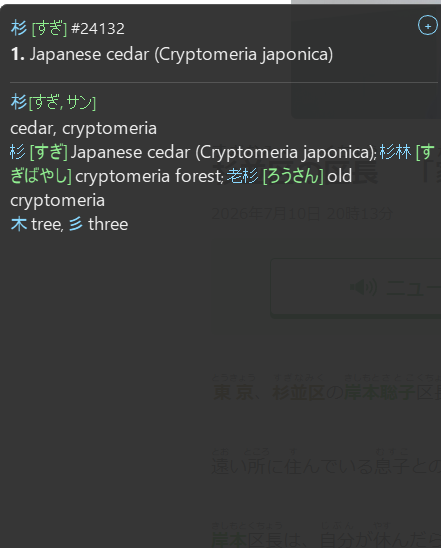
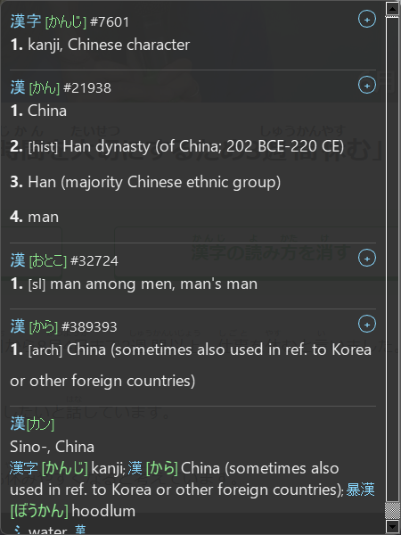

# minepop 🌸 (Anki-Mining Fork of meikipop)

This is a customized personal fork of [meikipop](https://github.com/rtr46/meikipop). All credit for the core OCR engine, positioning, and dictionary loading logic goes entirely to the original creator, **`rtr46`**! 

* For core details on features, dictionary building, and deep platform setups, please visit the [Original meikipop Repository & README](https://github.com/rtr46/meikipop).

> ⚠️ **Just a heads up:** This fork is personal "vibecode slop" configured to fit my own Japanese SRS study and Anki-mining setup. 

---

## 🛠️ Custom Features added in this Fork:

*   **Anki Settings & Mining:** Added a dedicated **Anki** settings tab [3]. You can enable mining, set your deck name, note model, and map fields with JSON [3].
*   **Shift Toggle Lock:** Tapping `Shift` once toggles the popup on and locks it in place [3]. This freezes the lookup window so you can easily move your mouse to click the "+" button [3]. Tapping `Shift` again closes it [3].
*   **Instant UI Window:** Tapping Shift instantly opens a compact loading window ("Scanning screen...") within milliseconds [3]. This hides the background OCR search lag [3].
*   **Yomitan Settings Importer:** Added an "Import from Yomitan" button [3]. You can load your exported Yomitan JSON backup file, and it automatically detects your active profile, grabs your deck/note type, and translates the fields [3].
*   **Disabled Notes Field:** The importer explicitly skips mapping to your "Notes" field during import, keeping it clean and empty.
*   **Full Dictionary Lists on Cards:** Formats all definitions and sub-bullets into a clean HTML numbered list inside Anki (looking just like browser-mined cards!).
*   **Anki Native Furigana:** Mined cards automatically write reading fields in the standard `Kanji[Kana]` format (like `厚い[あつい]`), letting Anki render hover furigana on top of your kanji natively [3].
*   **POS-Free Definitions:** Stripped out grammatical tags like `(n)` or `(v1, vt)` from both the on-screen popup and your mined cards, leaving only the actual meanings.
*   **Clean Sizing & Scrollbar:** Fixed the window width to `450px` and capped the height at `600px` with a vertical scrollbar [3]. We also added a vertical spacer, so short entries look compact and snug without empty grey boxes [3].
*   **Cursor Alignment:** Adjusted the scan coordinates slightly (+4px, +6px) so the lookup triggers exactly where the arrow head of your cursor is pointing [3].

---

## 📸 Screenshots

<p align="center">
  
  &nbsp;&nbsp;
  
</p>

The screenshots above show the popup in action: multiple dictionary entries are merged into a single clean, numbered list, with furigana rendered in the `Kanji[Kana]` format so Anki can display it natively once mined.

---

## 🚀 How to Run this Version

Because this is a custom fork, running `pip install meikipop` or downloading prepackaged binaries from the official release page **will not work**, as they will install the unedited upstream code instead of these custom mining features!

To run and use this fork locally, follow these steps:

### Option A: Install with pip (Recommended)

From the root of the repo, install it in editable mode so it picks up your local code:

```cmd
pip install -e .
```

Once installed, launch it with either command (both are aliased to the same app):

```cmd
meikipop
```
or
```cmd
minepop
```

If you make further code changes, you don't need to reinstall — editable installs (`-e .`) pick up edits automatically. You only need to re-run `pip install -e .` if you change `pyproject.toml` itself (e.g. dependencies, entry points).

### Option B: Direct Local Path Execution (No Install)

No installation is required. Open your terminal/command prompt at the root of your repo folder and run:

```cmd
set PYTHONPATH=src
python src/meikipop/main.py
```

### First-Time Setup

On first launch, the app will try to download a prebuilt dictionary. If that fails (e.g. `HTTP Error 404`), build the dictionary locally instead:

```cmd
meikipop build-dict
```

See the [Original meikipop Repository & README](https://github.com/rtr46/meikipop) for details on dictionary sources and formats.